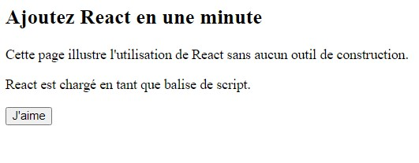

# Titre : Ajouter React à un site web

Suivez le lien [ici](https://fr.reactjs.org/docs/add-react-to-a-website.html)

#### Outils utilisé pour cette démo : VS-Code (uniquement)

## Ajouter React en une minute

Dans cette partie, nous allons voir comment ajouter un composant React à une page HTML existante. Vous pouvez suivre les étapes avec votre propre site web, ou avec une page HTML vide pour vous entraîner.

Pas besoin d’outils compliqués ni de faire des installations : pour suivre cette section, vous avez juste besoin d’une connexion à internet et d’une minute de votre temps.

### Étape 1 : ajouter un conteneur DOM à votre HTML

Pour commencer, ouvrez la page HTML que vous souhaitez modifier. Ajoutez une balise <div> vide pour indiquer l’endroit dans lequel vous souhaitez afficher quelque chose avec React. Par exemple :

```html
<!-- ... code HTML existant ... -->
<div id="like_button_container"></div>
<!-- ... code HTML existant ... -->
```

### Étape 2 : ajouter les balises de script

Ensuite, ajoutez trois balises <script> à votre page HTML, juste avant la fermeture de la balise </body> :

```html
  <!-- ... autres contenus HTML ... -->

  <!-- Charge React -->
  <!-- Remarque : pour le déploiement, remplacez "development.js"
       par "production.min.js" -->
  <script src="https://unpkg.com/react@16/umd/react.development.js" crossorigin></script>
  <script src="https://unpkg.com/react-dom@16/umd/react-dom.development.js" crossorigin></script>

  <!-- Charge notre composant React -->
  <script src="like_button.js"></script>
</body>
```

### Étape 3 : créer un composant React

- Créez un fichier nommé like_button.js dans le même dossier que votre page HTML.
- Ouvrez et copiez le code de démarrage et collez son contenu dans votre fichier.
- Ajoutez deux lignes à la fin de like_button.js, après le code de démarrage :

```js
// ... le code de démarrage que vous avez collé ...
const domContainer = document.querySelector("#like_button_container");
ReactDOM.render(e(LikeButton), domContainer);
```

### Et voilà !

N'oubliez pas d'enregister avant !
Pour voir le résultat avec VS-code, il suffit de "clique-droit" sur la page HTML, puis sélectionner "Open with Live Server".
La page s'affichera dans votre navigateur.

#### Voici le résultat:



#### Résultat, après avoir cliquer sur le bouton "Jaime":


